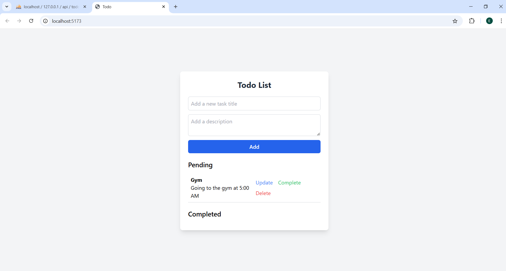
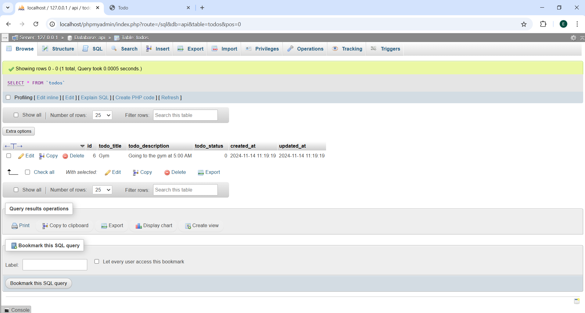

# Todo List Application

A simple Todo List application built with **React** as the frontend and **Laravel** as the backend. This app allows you to add, update, delete, and manage tasks categorized as **Pending** or **Completed**. The tasks are stored in a Laravel-based backend database.

## Features
- **Add** new todos with a title and description.
- **Update** existing todos.
- **Delete** todos from the list.
- **Toggle** todo status between **Pending** and **Completed**.

## Requirements
- **Node.js** 
- **npm**
- **Laravel**
- **PHP**
- **Composer**
- **MySQL** or another compatible database for Laravel

## Installation

### Backend Setup (Laravel)

**Clone the repository**:
   ```bash
   git clone https://github.com/Eshetu21/intern.git
   ```
   ```
   cd laravel-backend
   ```
   ```
   composer install
   ```
### Copy the .env
   cp .env.example .env
### Make sure the database connection is set
   DB_CONNECTION=mysql\
   DB_HOST=127.0.0.1\
   DB_PORT=3306\ 
   DB_DATABASE=api\
   DB_USERNAME=root\
   DB_PASSWORD=\   
### Run to migrate
   ```
   php artisan key:generate
   php artisan migrate
   php artisan serve
   ```

### Frontend Setup (React)
   ```
   cd react-frontend
   npm install
   ```
### In App.jsx, ensure the API endpoint points to your Laravel backend look like this:
   axios.get("http://localhost:8000/api/fetch")

### Screenshots

Here are some screenshots:





